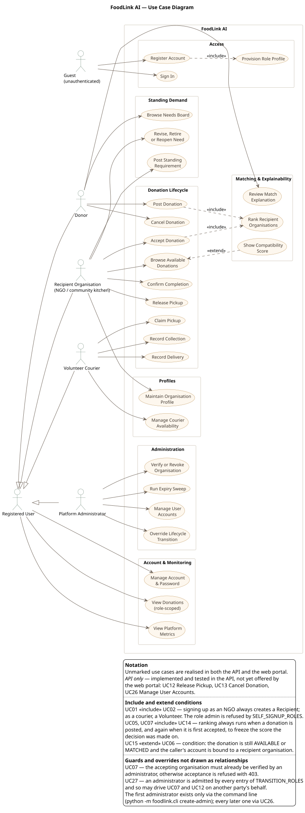
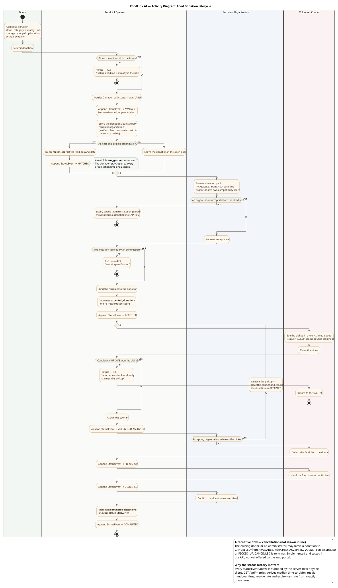
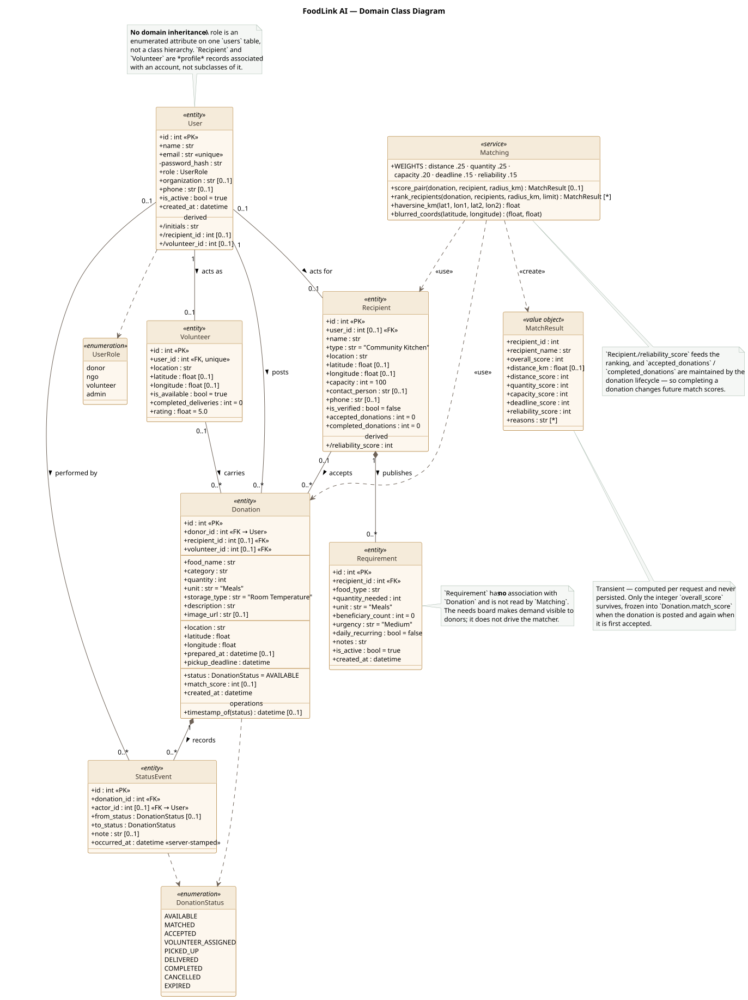

# FoodLink AI — UML System Design Documentation

**Project:** FoodLink AI (repository `UCS503P-202627-FoodBridge-AI`)
**Course:** UCS503P — Software Engineering
**Artefacts:** Use Case Diagram · Use Case Scenarios · Activity Diagram · Class Diagram

---

## 1. Purpose and Scope

FoodLink AI is a coordination platform for surplus food redistribution. A **donor**
posts surplus food; the platform **ranks** verified recipient organisations against
that donation using a transparent weighted heuristic; a **recipient organisation**
accepts it; a **volunteer courier** claims, collects and delivers it; the accepting
organisation confirms completion. Every transition is stamped by the server into an
append-only history, from which the platform's evaluation metrics are derived.

This document models **the implementation as it currently stands**. Every actor,
use case, activity and class below was verified against the source before being
drawn. Where a capability exists in the API but has not yet reached the web portal,
it is drawn and then explicitly marked — it is never silently presented as a
finished feature. Section 7 lists what was deliberately *excluded* for being absent
from the implementation.

**Primary sources of truth**

| Concern | File |
| --- | --- |
| Entities, roles, state machine | `code/foodlink/models.py` |
| Donation lifecycle and authorisation | `code/foodlink/routers/donations.py` |
| Organisations, needs, couriers | `code/foodlink/routers/organisations.py` |
| Administration | `code/foodlink/routers/admin.py` |
| Registration and login | `code/foodlink/routers/auth.py` |
| Ranking heuristic | `code/foodlink/matching.py` |
| Derived metrics | `code/foodlink/routers/metrics.py` |
| Portal routes and role guards | `frontend/src/App.tsx` |
| Client API surface | `frontend/src/lib/api.ts` |

---

## 2. Actors

Four of the five actors correspond exactly to a value of `UserRole` in
`code/foodlink/models.py`. The fifth is the unauthenticated caller.

| Actor | Implementation basis | Responsibility in the system |
| --- | --- | --- |
| **Guest** | Any caller without a bearer token. Only `POST /api/auth/register` and `POST /api/auth/login` are reachable, and both are rate-limited per client address. | Create an account, or sign in. |
| **Registered User** *(generalised actor)* | `security.get_current_user` — any authenticated, active account. | Holds the behaviour every role shares: manage own account, read role-scoped donations, read platform metrics. |
| **Donor** | `UserRole.donor` | Posts surplus food, tracks it, reads the needs board. |
| **Recipient Organisation** | `UserRole.ngo`, bound at registration to a `Recipient` row | Browses the open pool, accepts donations, publishes standing needs, confirms completion. |
| **Volunteer Courier** | `UserRole.volunteer`, bound at registration to a `Volunteer` row | Claims a pickup, records collection and delivery, sets own availability. |
| **Platform Administrator** | `UserRole.admin` | Vouches for organisations, manages accounts, runs the expiry sweep, and may drive lifecycle transitions on any record as a stand-in. |

**Why `admin` is not modelled as a specialisation of the other roles.** An
administrator is permitted in every entry of `TRANSITION_ROLES` and has unrestricted
read scope, so it *can* stand in for a donor or a courier on the lifecycle. It is
nevertheless not a generalisation of `Recipient Organisation`: an administrator
account has no `Recipient` row, so `POST /api/requirements` answers it with 422
(`test_an_administrator_has_no_organisation_to_edit_requirements_for`). The
override capability is therefore drawn as an `<<extend>>`, not as inheritance.

**`admin` cannot be self-assigned.** `SELF_SIGNUP_ROLES` admits only `donor`, `ngo`
and `volunteer`. The first administrator exists only through
`python -m foodlink.cli create-admin`; every later one through
`POST /api/admin/users`.

---

## 3. Use Case Diagram



**Source:** [`diagrams/01-use-case.puml`](diagrams/01-use-case.puml) ·
**Rendered:** [`FoodLink-UseCase.svg`](diagrams/FoodLink-UseCase.svg) ·
[`.png`](diagrams/FoodLink-UseCase.png)

The system boundary is labelled **FoodLink AI**. Actors sit outside it; use cases
are grouped into seven functional packages inside it. Conditions and guards are
carried in the legend rather than in floating notes, whose connectors would
otherwise cross the whole diagram.

### 3.1 Use cases by package

| # | Use case | Primary actor | Realised by |
| --- | --- | --- | --- |
| UC-01 | Register Account | Guest | `POST /api/auth/register` |
| UC-02 | Provision Role Profile | *(included)* | `Recipient` / `Volunteer` row created during registration |
| UC-03 | Sign In | Guest | `POST /api/auth/login` |
| UC-04 | Manage Account & Password | Registered User | `GET`/`PATCH /api/auth/me`, `POST /api/auth/password` |
| UC-05 | Post Donation | Donor | `POST /api/donations` |
| UC-06 | Browse Available Donations | Recipient Organisation | `GET /api/donations` (open pool scope) |
| UC-07 | Accept Donation | Recipient Organisation | `POST /api/donations/{id}/status` → `ACCEPTED` |
| UC-08 | Claim Pickup | Volunteer Courier | → `VOLUNTEER_ASSIGNED` |
| UC-09 | Record Collection | Volunteer Courier | → `PICKED_UP` |
| UC-10 | Record Delivery | Volunteer Courier | → `DELIVERED` |
| UC-11 | Confirm Completion | Recipient Organisation | → `COMPLETED` |
| UC-12 | Release Pickup *(API only)* | Recipient Organisation | `VOLUNTEER_ASSIGNED` → `ACCEPTED` |
| UC-13 | Cancel Donation *(API only)* | Donor | → `CANCELLED` |
| UC-14 | Rank Recipient Organisations | *(included)* | `matching.rank_recipients` |
| UC-15 | Show Compatibility Score | *(extension)* | `DonationOut.viewerMatch` |
| UC-16 | Review Match Explanation | Donor | `GET /api/donations/{id}/matches` |
| UC-17 | Post Standing Requirement | Recipient Organisation | `POST /api/requirements` |
| UC-18 | Revise, Retire or Reopen Need | Recipient Organisation | `PATCH /api/requirements/{id}` |
| UC-19 | Browse Needs Board | Donor | `GET /api/requirements` (donor scope) |
| UC-20 | Maintain Organisation Profile | Recipient Organisation | `GET`/`PATCH /api/recipients/me` |
| UC-21 | Manage Courier Availability | Volunteer Courier | `GET`/`PATCH /api/volunteers/me` |
| UC-22 | View Donations (role-scoped) | Registered User | `GET /api/donations`, `GET /api/donations/{id}` |
| UC-23 | View Platform Metrics | Registered User | `GET /api/metrics` |
| UC-24 | Verify or Revoke Organisation | Administrator | `POST`/`DELETE /api/admin/recipients/{id}/verify` |
| UC-25 | Run Expiry Sweep | Administrator | `POST /api/admin/maintenance/expire` |
| UC-26 | Manage User Accounts *(API/CLI only)* | Administrator | `POST`/`PATCH /api/admin/users`, `foodlink.cli` |
| UC-27 | Override Lifecycle Transition | Administrator | admin is admitted in every `TRANSITION_ROLES` entry |

### 3.2 Relationships used, and why each is justified

| Relationship | Justification in code |
| --- | --- |
| UC-01 `<<include>>` UC-02 | `routers/auth.register` **always** creates a `Recipient` for an `ngo` sign-up and a `Volunteer` for a `volunteer` sign-up. Registration is never complete without it. |
| UC-05 `<<include>>` UC-14 | `create_donation` always calls `rank_recipients`; a successful posting cannot occur without the ranking running. |
| UC-07 `<<include>>` UC-14 | A first acceptance re-runs `rank_recipients` against the accepting organisation to freeze `match_score` at the moment of decision. |
| UC-15 `<<extend>>` UC-06 | `viewerMatch` is populated **only when** the donation is still `AVAILABLE`/`MATCHED` *and* the caller's account resolves to a recipient organisation. Conditional behaviour on a base use case that is complete without it — the definition of `<<extend>>`. |

Two relationships were **deliberately not drawn**, and are stated in the diagram's
legend instead:

- **Authentication.** Every use case except UC-01 and UC-03 depends on
  `get_current_user`. An "Authenticate Request" include would attach to 25 of 27
  use cases and destroy readability without adding information.
- **UC-27 extending UC-07 and UC-12.** An administrator may accept or release on
  another party's behalf, which is genuine `<<extend>>` behaviour, but the two
  edges spanned the full height of the diagram and crossed several packages. The
  override is described in the legend, where it reads more clearly than a pair of
  long dashed lines.

---

## 4. Use Case Scenarios

> **A fuller treatment now lives in its own document.**
> [`FoodLink-Use-Case-Scenarios.md`](FoodLink-Use-Case-Scenarios.md) (and its PDF)
> is the submission-ready version: it covers all **24** actor-driven use cases
> rather than the 16 summarised here, names every scenario exactly as the Use
> Case Diagram labels it, and states for each whether the capability is
> reachable through the web portal or through the API only. Treat it as
> authoritative where the two differ; this section is kept as an inline summary
> so the UML package still reads end to end on its own.

Format: Name · Primary Actor · Goal · Preconditions · Main Success Flow ·
Alternative / Exception Flows · Postconditions.

---

### UC-01 — Register Account

- **Primary actor:** Guest
- **Goal:** Obtain a FoodLink account and an access token for one of the three
  self-service roles.
- **Preconditions:** The email address is not already registered. The request is
  within the per-address rate limit.

**Main success flow**
1. Guest chooses a role — donor, recipient organisation, or volunteer courier.
2. Guest supplies name, email, password and (optionally) an organisation name.
3. System rejects `admin` at the schema boundary; the three self-signup roles pass.
4. System hashes the password (bcrypt) and creates the `User`.
5. *Include UC-02:* for `ngo` the system creates a `Recipient` row with
   `is_verified = false`; for `volunteer` it creates a `Volunteer` row.
6. System issues a signed JWT and returns it with the user record (HTTP 201).

**Alternative / exception flows**
- **A1 — Email already in use:** HTTP 409, no account created.
- **A2 — Rate limit exceeded:** the request is refused before any account work.
- **A3 — `admin` requested:** refused by request-schema validation (422).

**Postconditions:** The account exists and is active. An NGO account is
**unverified** and therefore cannot yet accept donations or be ranked by the matcher.

---

### UC-03 — Sign In

- **Primary actor:** Guest
- **Goal:** Exchange credentials for a bearer token and land in the portal for the
  account's role.
- **Preconditions:** The account exists.

**Main success flow**
1. Guest submits email and password.
2. System looks up the account by lower-cased email and verifies the bcrypt hash.
3. System confirms the account is active.
4. System issues a JWT carrying the user id, role and expiry, and returns the user.
5. The portal redirects to the home path for that role.

**Alternative / exception flows**
- **A1 — Unknown email or wrong password:** HTTP 401 with a single message for both
  cases, so the response does not confirm which addresses hold accounts.
- **A2 — Deactivated account:** HTTP 403, "This account has been deactivated."
- **A3 — Rate limit exceeded:** the attempt is refused.

**Postconditions:** The client holds a token whose expiry is fixed at issue.

---

### UC-05 — Post Donation

- **Primary actor:** Donor *(an administrator may also post)*
- **Goal:** Publish surplus food so that recipient organisations can claim it before
  it spoils.
- **Preconditions:** Caller is authenticated as a donor or administrator.

**Main success flow**
1. Donor supplies food name, category, quantity, unit, storage type, description,
   pickup location with coordinates, and a pickup deadline.
2. System confirms the deadline lies in the future.
3. System persists the `Donation` with `status = AVAILABLE`.
4. System appends a server-stamped `StatusEvent` → `AVAILABLE`.
5. *Include UC-14:* system scores the donation against every recipient organisation
   that is verified, has coordinates, and lies within the service radius.
6. If at least one organisation is eligible, the system freezes the leading
   candidate's score into `Donation.match_score` and appends a `StatusEvent` →
   `MATCHED`, noting the organisation's name.
7. System returns the donation.

**Alternative / exception flows**
- **A1 — Deadline already past:** HTTP 422; nothing is stored.
- **A2 — Payload fails validation:** HTTP 422.
- **A3 — No eligible organisation:** the donation remains `AVAILABLE` with no
  `match_score`. This is a normal outcome, not an error.

**Postconditions:** The donation is in the open pool (`AVAILABLE` or `MATCHED`) and
visible to every recipient organisation. **No organisation is bound to it** — a
match is a suggestion, not a claim.

---

### UC-06 — Browse Available Donations

- **Primary actor:** Recipient Organisation
- **Goal:** See what is currently on offer, and how well each offer suits *this*
  kitchen.
- **Preconditions:** Caller is authenticated as an NGO account.

**Main success flow**
1. Organisation opens the available-donations screen.
2. System applies the read scope: donations whose status is `AVAILABLE` or
   `MATCHED`, plus every donation already bound to this organisation.
3. *Extend UC-15:* for each donation still open to acceptance, the system scores the
   pairing against **this** organisation and attaches it as `viewerMatch` — the
   headline percentage and the five-criterion breakdown as one object.
4. The portal renders the list ordered by pickup deadline.

**Alternative / exception flows**
- **A1 — Account has no organisation row yet:** the open pool is still returned;
  no `viewerMatch` is attached.
- **A2 — Donation no longer open:** `viewerMatch` is null and the frozen
  `match_score` is shown instead, since that is the figure the decision was made on.

**Postconditions:** No state change. Reads only.

---

### UC-07 — Accept Donation

- **Primary actor:** Recipient Organisation *(administrator may accept on a
  kitchen's behalf)*
- **Goal:** Commit the organisation to receiving a donation.
- **Preconditions:** The donation is `AVAILABLE` or `MATCHED`. The caller's
  organisation is **verified**.

**Main success flow**
1. Organisation selects a donation from the open pool and accepts it.
2. System confirms `AVAILABLE → ACCEPTED` or `MATCHED → ACCEPTED` is a legal move.
3. System confirms the caller's role may set `ACCEPTED`.
4. System resolves the accepting organisation from the caller's own account.
5. System confirms the organisation is verified.
6. System binds `recipient_id`, increments `accepted_donations`, and re-freezes
   `match_score` from a fresh ranking against this organisation.
7. System appends a `StatusEvent` → `ACCEPTED`.

**Alternative / exception flows**
- **A1 — Organisation not verified:** HTTP 403, "awaiting verification". The donation
  stays in the pool.
- **A2 — Another organisation accepted first:** the donation is no longer in
  `AVAILABLE`/`MATCHED`, so the move is refused with HTTP 409.
- **A3 — Caller names a different organisation:** HTTP 403 — an NGO may only accept
  as itself; only an administrator may name an arbitrary organisation.
- **A4 — Caller's account has no organisation:** HTTP 422.

**Postconditions:** The donation is `ACCEPTED` and bound to the organisation. It
leaves the open pool and becomes visible to couriers as an unclaimed pickup.

---

### UC-08 — Claim Pickup

- **Primary actor:** Volunteer Courier
- **Goal:** Take responsibility for collecting and delivering an accepted donation.
- **Preconditions:** The donation is `ACCEPTED` with no courier assigned. The caller
  has a courier profile.

**Main success flow**
1. Courier sees the pickup in the unclaimed queue.
2. Courier claims it.
3. System issues **one conditional UPDATE** that sets `volunteer_id` only where the
   status is unchanged *and* the pickup is unclaimed or already this courier's.
4. The update affects exactly one row — the claim is won.
5. System appends a `StatusEvent` → `VOLUNTEER_ASSIGNED`.

**Alternative / exception flows**
- **A1 — Another courier won the race:** the conditional UPDATE affects no rows.
  The system re-reads the row and answers HTTP 409, "Another courier has already
  claimed this pickup."
- **A2 — The donation changed state meanwhile:** HTTP 409 naming the illegal move.
- **A3 — The same courier sends a duplicate request:** the claim succeeds once; the
  status guard prevents a second `StatusEvent` being appended.
- **A4 — Account has no courier profile:** HTTP 422.

**Postconditions:** The courier is bound to the pickup, and no other courier can
claim it while the binding stands.

---

### UC-09 / UC-10 — Record Collection and Record Delivery

- **Primary actor:** Volunteer Courier
- **Goal:** Advance the physical handover and leave an attributable record of when
  each leg happened.
- **Preconditions:** The caller is the courier **assigned to this donation**
  (an administrator may act as a stand-in).

**Main success flow**
1. On collecting the food from the donor, the courier records collection; the system
   moves `VOLUNTEER_ASSIGNED → PICKED_UP` and appends the event.
2. On handing the food over at the kitchen, the courier records delivery; the system
   moves `PICKED_UP → DELIVERED` and appends the event.

**Alternative / exception flows**
- **A1 — A courier who is not the assignee attempts either step:** the system
  re-reads the donation through the courier's own read scope, finds nothing, and
  answers **HTTP 404** rather than 403 — a 403 would confirm the donation exists.
- **A2 — Out-of-order request** (for example delivering before collecting):
  HTTP 409.

**Postconditions:** The donation has reached `DELIVERED`; the acceptance-to-delivery
interval is now derivable from the status history.

---

### UC-11 — Confirm Completion

- **Primary actor:** Recipient Organisation
- **Goal:** Confirm the food was received, closing the donation successfully.
- **Preconditions:** The donation is `DELIVERED` and bound to the caller's
  organisation.

**Main success flow**
1. Organisation confirms receipt.
2. System confirms `DELIVERED → COMPLETED` is legal and that the caller's role may
   set `COMPLETED`.
3. System re-reads the donation through the caller's read scope, confirming this is
   the accepting organisation.
4. System increments the organisation's `completed_donations` and the courier's
   `completed_deliveries`.
5. System appends a `StatusEvent` → `COMPLETED`.

**Alternative / exception flows**
- **A1 — An unrelated organisation attempts completion:** HTTP 404.
- **A2 — Donation not yet delivered:** HTTP 409. `COMPLETED` is reachable only from
  `DELIVERED`.

**Postconditions:** `COMPLETED` is terminal. The organisation's reliability score
and the courier's delivery count both change, which alters **future** match
rankings.

---

### UC-12 — Release Pickup  *(implemented in the API; not yet in the portal)*

- **Primary actor:** Recipient Organisation *(or administrator as stand-in)*
- **Goal:** Return a pickup to the courier queue when the assigned courier cannot
  complete it.
- **Preconditions:** The donation is `VOLUNTEER_ASSIGNED` and bound to the caller's
  organisation.

**Main success flow**
1. Organisation releases the pickup.
2. System confirms the caller owns this donation — release is *not* an offer any
   kitchen may take, so ownership is required here even though ordinary acceptance
   is open.
3. System clears `volunteer_id`, so the pickup becomes visible and claimable again.
4. System appends a `StatusEvent` → `ACCEPTED`.

**Alternative / exception flows**
- **A1 — A peer organisation attempts the release:** HTTP 404; the binding is
  untouched. In particular the peer cannot take ownership of the donation this way.
- **A2 — The assigned courier attempts to release themselves:** refused on role —
  `ACCEPTED` is not a transition a courier may drive.

**Postconditions:** The donation is `ACCEPTED` with no courier. `accepted_donations`
is **not** incremented again and `match_score` is **not** re-frozen — a release is
not a second acceptance.

---

### UC-13 — Cancel Donation  *(implemented in the API; not yet in the portal)*

- **Primary actor:** Donor *(or administrator)*
- **Goal:** Withdraw a donation that can no longer be given.
- **Preconditions:** The caller posted this donation. The donation is in
  `AVAILABLE`, `MATCHED`, `ACCEPTED`, `VOLUNTEER_ASSIGNED` or `PICKED_UP`.

**Main success flow**
1. Donor cancels the donation.
2. System confirms the move to `CANCELLED` is legal from the current state and that
   the caller's role may set it.
3. System re-reads the donation through the donor's read scope, confirming ownership.
4. System appends a `StatusEvent` → `CANCELLED`.

**Alternative / exception flows**
- **A1 — A different donor attempts cancellation:** HTTP 404.
- **A2 — Donation already `DELIVERED`, `COMPLETED`, `EXPIRED` or `CANCELLED`:**
  HTTP 409 — cancellation is not reachable from those states.
- **A3 — A recipient organisation or courier attempts cancellation:** HTTP 403 on
  role.

**Postconditions:** `CANCELLED` is terminal. The donation counts toward neither the
rescue rate nor the expiry-loss rate.

---

### UC-17 — Post Standing Requirement

- **Primary actor:** Recipient Organisation
- **Goal:** Publish an ongoing need so donors can see demand before supply exists.
- **Preconditions:** The caller's account is bound to a recipient organisation.

**Main success flow**
1. Organisation supplies food type, quantity needed, unit, beneficiary count,
   urgency, whether the need recurs daily, and notes.
2. System creates the `Requirement` against the caller's organisation with
   `is_active = true`.
3. System returns the requirement, carrying the posting organisation's verification
   state so a donor board can label the card.

**Alternative / exception flows**
- **A1 — Administrator attempts to post:** the role gate admits them, but an
  administrator account has no organisation, so the system answers HTTP 422.
- **A2 — Invalid quantity or empty food type:** HTTP 422.

**Postconditions:** The need appears on the organisation's own board, and — if the
organisation is verified — on every donor's needs board.

---

### UC-18 — Revise, Retire or Reopen a Standing Need

- **Primary actor:** Recipient Organisation
- **Goal:** Keep the board honest: correct a need, take a met need off the board, or
  put a retired need back.
- **Preconditions:** The requirement belongs to the caller's organisation.

**Main success flow**
1. Organisation edits a need, or toggles it retired / reopened.
2. System resolves the requirement **within the caller's organisation only**.
3. System applies the supplied fields; `isActive: false` retires the need and
   `isActive: true` reopens it.
4. The row is kept either way, so the demand history survives.

**Alternative / exception flows**
- **A1 — Another organisation's requirement id:** HTTP 404, indistinguishable from
  an id that never existed.
- **A2 — An explicit null for a field:** the field is left alone rather than
  cleared — no requirement column is nullable, so null cannot mean "clear".
- **A3 — A donor or courier attempts the edit:** HTTP 403 on role.

**Postconditions:** A retired need leaves the donor board immediately; the owning
organisation can still list it via `includeInactive` and reopen it later.

---

### UC-19 — Browse Needs Board

- **Primary actor:** Donor
- **Goal:** See what organisations currently need, in order to decide what to donate.
- **Preconditions:** Caller is authenticated as a donor.

**Main success flow**
1. Donor opens the needs board.
2. System returns **active** requirements posted by **verified** organisations,
   newest first.
3. The portal renders each need with its organisation, urgency and beneficiary count.

**Alternative / exception flows**
- **A1 — Donor requests retired needs (`includeInactive=true`):** the flag is
  ignored for donors. A retired need is not an offer and a donor has no action on
  it, so this is a permission rather than a filter the caller may choose.
- **A2 — A courier calls the endpoint:** an empty list. Standing demand is not an
  input to a courier's work.
- **A3 — No verified organisation has posted a need:** an empty board, not an error.

**Postconditions:** No state change.

---

### UC-20 — Maintain Organisation Profile

- **Primary actor:** Recipient Organisation
- **Goal:** Complete the profile so the organisation can actually be matched.
- **Preconditions:** Caller is an NGO account with an organisation row.

**Main success flow**
1. Organisation opens its profile.
2. Organisation revises name, type, address, capacity, contact person or phone.
3. System applies only the supplied fields and returns the updated record.

**Alternative / exception flows**
- **A1 — Caller attempts to set `is_verified`:** the field is absent from the update
  schema; an organisation cannot vouch for itself.
- **A2 — Account has no organisation row:** HTTP 422.

**Postconditions:** Capacity and location feed the ranking heuristic.
**Known limitation:** the API accepts `latitude`/`longitude` here, but the web
profile form does not send them, and the sign-up form does not collect them — see
§ 8.

---

### UC-24 — Verify or Revoke Organisation

- **Primary actor:** Platform Administrator
- **Goal:** Vouch for a real organisation, or withdraw that endorsement.
- **Preconditions:** Caller holds an administrator token.

**Main success flow**
1. Administrator reviews the organisation directory and the pending count.
2. Administrator marks the organisation verified.
3. System sets `is_verified = true` and returns the organisation.

**Alternative / exception flows**
- **A1 — Unknown organisation id:** HTTP 404.
- **A2 — Revocation:** the same route with `DELETE` sets `is_verified = false`. The
  organisation immediately drops out of the matcher and can no longer accept
  donations; donations it has already accepted are unaffected.
- **A3 — A non-administrator calls the route:** HTTP 403 at the router-level gate.

**Postconditions:** Verification is the platform's single trust gate: it decides
whether an organisation is ranked, whether it may accept a donation, and whether its
standing needs reach the donor board.

---

### UC-25 — Run Expiry Sweep

- **Primary actor:** Platform Administrator
- **Goal:** Move donations nobody claimed before their deadline into a terminal
  state, so losses are recorded rather than left looking available forever.
- **Preconditions:** Caller holds an administrator token.

**Main success flow**
1. Administrator triggers the sweep.
2. System selects every donation still `AVAILABLE` or `MATCHED` whose
   `pickup_deadline` has passed.
3. For each, the system appends a `StatusEvent` → `EXPIRED` noting "Deadline passed
   with no recipient", and sets the status.
4. System returns the number expired.

**Alternative / exception flows**
- **A1 — Nothing is overdue:** the sweep reports zero. Not an error.
- **A2 — A donation already accepted:** untouched. Only unclaimed donations expire.

**Postconditions:** Expired donations become part of the expiry-loss rate.
**Note:** the sweep's events carry **no actor**, because no person performed the
transition. There is no scheduler in the repository — the sweep runs only when a
person triggers it.

---

## 5. Activity Diagram



**Source:** [`diagrams/02-activity-donation-lifecycle.puml`](diagrams/02-activity-donation-lifecycle.puml) ·
**Rendered:** [`FoodLink-Activity-DonationLifecycle.svg`](diagrams/FoodLink-Activity-DonationLifecycle.svg) ·
[`.png`](diagrams/FoodLink-Activity-DonationLifecycle.png)

### 5.1 What it models

The central business workflow: **one donation from posting to completion**, across
four swimlanes — Donor, Recipient Organisation, Volunteer Courier, and the FoodLink
System. Every decision node is a branch the server actually takes:

| Decision in the diagram | Enforced by |
| --- | --- |
| Pickup deadline still in the future? | `create_donation` — 422 otherwise |
| At least one eligible organisation? | `matching.score_pair` gates on verification, coordinates and service radius |
| An organisation accepts before the deadline? | otherwise the expiry sweep terminates the donation |
| Organisation verified by an administrator? | `update_status`, `ACCEPTED` branch — 403 otherwise |
| Conditional UPDATE won the claim? | `_claim_pickup` — 409 otherwise |
| Accepting organisation releases the pickup? | `VOLUNTEER_ASSIGNED → ACCEPTED`, which returns the pickup to the queue |

The release loop is drawn as a genuine cycle: a released pickup re-enters the
unclaimed queue and may be claimed by any courier, including the original one.

### 5.2 The underlying state machine

The diagram is a traversal of `ALLOWED_TRANSITIONS`. The full machine, with the role
gate from `TRANSITION_ROLES` and the ownership rule from `_needs_ownership`:

| From | To | Roles permitted | Must the caller own the donation? |
| --- | --- | --- | --- |
| `AVAILABLE` | `MATCHED` | admin *(also set by the system at posting)* | no |
| `AVAILABLE` / `MATCHED` | `ACCEPTED` | ngo, admin | no — this is the open offer |
| `AVAILABLE` / `MATCHED` | `EXPIRED` | admin | no |
| `AVAILABLE` / `MATCHED` / `ACCEPTED` / `VOLUNTEER_ASSIGNED` / `PICKED_UP` | `CANCELLED` | donor, admin | **yes** |
| `ACCEPTED` | `VOLUNTEER_ASSIGNED` | volunteer, admin | settled by the conditional UPDATE |
| `ACCEPTED` | `EXPIRED` | admin | no |
| `VOLUNTEER_ASSIGNED` | `ACCEPTED` *(release)* | ngo, admin | **yes** |
| `VOLUNTEER_ASSIGNED` | `PICKED_UP` | volunteer, admin | **yes** |
| `PICKED_UP` | `DELIVERED` | volunteer, admin | **yes** |
| `DELIVERED` | `COMPLETED` | ngo, admin | **yes** |
| `COMPLETED` / `CANCELLED` / `EXPIRED` | — | terminal | — |

An unauthorised *owner* is answered with **404**, not 403: the read scope is
re-applied to the row, so an actor outside it cannot even confirm the donation
exists. An unauthorised *role* is answered with 403; an illegal move with 409.

**One transition is unreachable.** `ALLOWED_TRANSITIONS` permits
`MATCHED → AVAILABLE`, but `TRANSITION_ROLES` has no entry for `AVAILABLE`, so the
role check resolves to an empty set and every caller is refused with 403. It is
therefore omitted from the activity diagram — see § 8.

### 5.3 What is deliberately not in the activity diagram

Nothing was added that the implementation does not do. In particular there are **no**
notification steps, **no** route planning or ETA calculation, **no** automatic
courier assignment, **no** scheduled expiry job, **no** payment and **no** learned
recommendation model. Cancellation is shown as a documented alternative flow rather
than an interrupting edge from five different states, which would have made the
diagram unreadable for no gain.

---

## 6. Class Diagram



**Source:** [`diagrams/03-class-domain-model.puml`](diagrams/03-class-domain-model.puml) ·
**Rendered:** [`FoodLink-ClassDiagram.svg`](diagrams/FoodLink-ClassDiagram.svg) ·
[`.png`](diagrams/FoodLink-ClassDiagram.png)

### 6.1 Classes included

Six persistent entities and two enumerations from `code/foodlink/models.py`, plus
the matching service and its result object from `code/foodlink/matching.py`:

`User` · `Recipient` · `Volunteer` · `Donation` · `StatusEvent` · `Requirement` ·
`UserRole` · `DonationStatus` · `Matching` · `MatchResult`

### 6.2 Relationships and multiplicities

Each multiplicity follows the nullability of the actual foreign-key column.

| Relationship | Multiplicity | Column |
| --- | --- | --- |
| `User` acts for `Recipient` | 0..1 ── 0..1 | `recipients.user_id` (nullable) |
| `User` acts as `Volunteer` | 1 ── 0..1 | `volunteers.user_id` (not null, unique) |
| `User` posts `Donation` | 1 ── 0..* | `donations.donor_id` (not null) |
| `Recipient` accepts `Donation` | 0..1 ── 0..* | `donations.recipient_id` (nullable) |
| `Volunteer` carries `Donation` | 0..1 ── 0..* | `donations.volunteer_id` (nullable) |
| `Donation` **composes** `StatusEvent` | 1 ──◆ 0..* | cascade `all, delete-orphan` |
| `Recipient` **composes** `Requirement` | 1 ──◆ 0..* | cascade `all, delete-orphan` |
| `StatusEvent` performed by `User` | 0..* ── 0..1 | `status_events.actor_id` (nullable — the expiry sweep has no actor) |

The two composition (filled diamond) relationships are exactly the two SQLAlchemy
relationships declared with `cascade="all, delete-orphan"`: a status event and a
standing requirement cannot outlive their parent. Every other association is an
ordinary reference.

### 6.3 Deliberate omissions

Pydantic request/response schemas (`code/foodlink/schemas.py`), routers,
authentication helpers, the rate limiter, migrations and the CLI were left out.
They are application plumbing rather than domain concepts, and including them would
produce a code map rather than a domain model. Two consequences are worth stating:

- The only inheritance anywhere in the project is between **DTOs**
  (`UserAdminOut` extends `UserOut`; `RequirementOut` extends `RequirementCreate`).
  There is no inheritance in the domain model.
- `MatchResult` is transient. It is computed per request and never stored; only the
  integer `overall_score` survives, frozen into `Donation.match_score`.

---

## 7. Modeling Notes

These are the decisions where FoodLink departs from what a generic food-donation
platform is usually drawn as. Each one is a property of the implementation, not a
simplification made for the diagram.

**N1 — Roles are an enumerated attribute, not a class hierarchy.**
The obvious model would be `User` specialised into `Donor`, `NGO`, `Volunteer` and
`Admin`. The implementation instead keeps one `users` table with a
`role : UserRole` column, and attaches *profile* rows (`Recipient`, `Volunteer`)
by association. The class diagram reflects that, so `Recipient` is drawn as an
associated organisation record rather than as a subclass of `User`.

**N2 — A "match" is a suggestion, never an assignment.**
Ranking runs automatically when a donation is posted and moves it to `MATCHED`, but
`MATCHED` binds nobody. Any verified organisation may still accept. This is why the
activity diagram routes every donation through an explicit acceptance step, and why
`MATCHED` sits inside the "open pool" alongside `AVAILABLE`.

**N3 — Two different numbers are both called a "match score".**
`Donation.match_score` is the *frozen* figure — the leading candidate at posting
time, re-frozen against the accepting organisation on first acceptance.
`viewerMatch` is a *live* score computed for whichever organisation is reading, and
is null once the donation is no longer open to acceptance. The use case diagram
keeps them apart: UC-14 produces the frozen figure, UC-15 the reader's own.

**N4 — Standing requirements do not drive the matcher.**
`Requirement` has no association with `Donation`, and `matching.py` never reads it.
The needs board makes demand visible to donors so they can decide what to cook or
set aside; matching is purely `Donation × Recipient`. This is the single most
likely thing to be mis-drawn from the project description, so the class diagram
states it explicitly.

**N5 — Verification is the platform's only trust gate.**
`Recipient.is_verified` decides three things at once: whether the organisation is
ranked at all, whether it may accept a donation, and whether its standing needs
reach a donor's board. There is no separate approval workflow, no document upload
and no rating-based trust — so none is drawn.

**N6 — Concurrency is part of the business rule, not an implementation detail.**
Two couriers can see the same unclaimed pickup. The claim is settled by a single
conditional UPDATE, so exactly one wins and the loser receives HTTP 409. The
activity diagram shows this as a real decision node because it is a real branch
users experience.

**N7 — Release is not a second acceptance.**
`VOLUNTEER_ASSIGNED → ACCEPTED` reuses the `ACCEPTED` state, but the implementation
distinguishes the two paths: on a release the courier is cleared, while
`accepted_donations` is *not* incremented and `match_score` is *not* re-frozen. The
activity diagram therefore draws release as a loop back into the courier queue
rather than as a re-entry into the acceptance step.

**N8 — Authorisation failures on an owned record answer 404, not 403.**
Ownership is enforced by re-reading the donation through the caller's own read
scope. An actor outside that scope is told the donation does not exist, because a
403 would confirm that it does. The scenarios record 404 wherever that is what the
system actually returns.

**N9 — Location-derived figures are scoped, and sometimes withheld.**
`distanceKm` and `matchScore` are exact functions of an organisation's coordinates,
which the recipient directory deliberately withholds from donors and couriers. The
server therefore returns them only to an administrator or to the organisation
concerned, and ranks other organisations against a coarsened position. This is why
no "show distance to recipient" use case appears for the donor actor.

**N10 — Metrics are derived, never self-reported.**
Every figure from `GET /api/metrics` — median time-to-claim, median handover time,
rescue rate, expiry-loss rate — is computed from `StatusEvent` rows stamped by the
server. That is why the activity diagram records an explicit "append StatusEvent"
action at each transition rather than treating status as a simple field update.

**N11 — Administrator override is broad but not total.**
An administrator is admitted by every entry of `TRANSITION_ROLES`, but two paths
still refuse them for structural reasons: they cannot post a standing requirement
(no organisation), and they cannot claim a pickup (no courier profile — HTTP 422).
UC-27 is therefore drawn as an `<<extend>>` on specific use cases rather than as a
blanket capability.

**N12 — Mobile and desktop are one application.**
`frontend/src/mobile/` re-renders the same portals in a phone layout against the
same API. No mobile-specific use case exists, so none is drawn.

---

## 8. Implementation Limitations Affecting the Diagrams

Recorded for accuracy; **no source was changed** while producing this document.

1. **Cancellation and release have no user interface.** `CANCELLED` and the
   `VOLUNTEER_ASSIGNED → ACCEPTED` release are implemented, authorised and covered
   by tests (`test_lifecycle_authorization.py`, `test_pickup_release.py`), but no
   screen drives either. UC-12 and UC-13 are marked *(API only)*.
2. **Administrator account management has no user interface.**
   `POST /api/admin/users` and `PATCH /api/admin/users/{id}` are implemented, but
   `frontend/src/lib/api.ts` exposes them without any screen calling them. UC-26 is
   marked *(API/CLI only)*.
3. **`MATCHED → AVAILABLE` is unreachable.** It is listed in `ALLOWED_TRANSITIONS`
   but has no `TRANSITION_ROLES` entry, so every caller is refused with 403. It is
   omitted from the activity diagram.
4. **Organisation coordinates cannot be set through the portal.** The sign-up form
   posts only name, email, password, role and organisation; the NGO profile form
   posts name, type, location text, capacity, contact and phone — never
   `latitude`/`longitude`, although `PATCH /api/recipients/me` accepts them. The
   project carries **no geocoder** (a recorded architectural decision), so the
   free-text address is never converted into coordinates either. An organisation
   created entirely through the web UI therefore has no coordinates and can never be
   matched, because `score_pair` returns `None` for a recipient without them.
   Seeded organisations and any created via the API do have coordinates. The
   activity diagram's "at least one eligible organisation?" decision is drawn with
   this in mind.
5. **The expiry sweep has no scheduler.** It is an administrator-triggered endpoint,
   surfaced on the admin donations screen. It is drawn as an administrator-triggered
   system action, not as an automatic timer.
6. **`GET /api/metrics` is not role-scoped.** Any authenticated account reads the
   same platform-wide figures, which is why UC-23 is attached to *Registered User*
   rather than to the administrator.

---

## 9. Rendering the Diagrams

The diagram sources are PlantUML. All three were rendered with **PlantUML
1.2025.4** on OpenJDK 21, and the SVG and PNG outputs are committed alongside the
sources. PlantUML names its output after the `@startuml` identifier, not after the
source filename:

| Source | Rendered output | Page shape |
| --- | --- | --- |
| `diagrams/01-use-case.puml` | `diagrams/FoodLink-UseCase.svg` / `.png` | 841 × 2232 — tall; suits a portrait page |
| `diagrams/02-activity-donation-lifecycle.puml` | `diagrams/FoodLink-Activity-DonationLifecycle.svg` / `.png` | 1653 × 2872 — portrait |
| `diagrams/03-class-domain-model.puml` | `diagrams/FoodLink-ClassDiagram.svg` / `.png` | 1372 × 1833 — close to A4 portrait |

Prefer the **SVG** for submission: it stays sharp at any scale, which matters for
the use case diagram in particular.

### Editable diagrams.net copies

Each diagram is also committed as a native `.drawio` document —
`FoodLink-UseCase.drawio`, `FoodLink-Activity-DonationLifecycle.drawio` and
`FoodLink-ClassDiagram.drawio` — for coursework that must be submitted in
diagrams.net form. They are uncompressed `mxGraphModel` XML, open directly in
diagrams.net, and every shape, connector and label is individually editable.
Packages, swimlanes and class compartments are real containers rather than a flat
pile of shapes. Decision nodes are hexagons there, matching how PlantUML renders a
labelled condition; the unlabelled merge nodes are diamonds. See
`docs/uml/README.md` for the full conversion notes. **The `.puml` files remain the
source of truth** — edit those and regenerate rather than maintaining both by hand.

### Re-rendering after an edit

**Option A — PlantUML jar (Java 21 is available on this machine).**

```bash
java -jar plantuml.jar -tsvg docs/uml/diagrams/*.puml
```

Use `-tpng` for PNG or `-tpdf` for PDF. Validate a source without producing an
image using `-checkonly`; it exits non-zero on a syntax error.

**Option B — VS Code (no command line).** Install the *PlantUML* extension, open a
`.puml` file and press `Alt+D` to preview; export with
*PlantUML: Export Current Diagram*.

**Option C — an online renderer.** Paste a file's contents into any PlantUML web
server. Note that this uploads the diagram source to a third party.

---

## 10. Verification Record

Every element of every diagram was checked against the repository rather than
against the project description or the `ai/` documentation.

| Check | Source consulted |
| --- | --- |
| Actors match the real role enumeration | `models.UserRole`, `models.SELF_SIGNUP_ROLES` |
| Each use case corresponds to an implemented route | `routers/auth.py`, `routers/donations.py`, `routers/organisations.py`, `routers/admin.py`, `routers/metrics.py` |
| Which use cases reach the portal | `frontend/src/App.tsx`, `frontend/src/lib/api.ts`, `frontend/src/context/AppContext.tsx`, and the call sites of `updateDonationStatus` |
| Activity flow matches the state machine | `models.ALLOWED_TRANSITIONS`, `routers/donations.TRANSITION_ROLES`, `routers/donations.update_status`, `_claim_pickup`, `_needs_ownership` |
| Race and release behaviour | `code/tests/test_courier_claim.py`, `code/tests/test_pickup_release.py` |
| Ownership and 404-not-403 behaviour | `code/tests/test_lifecycle_authorization.py` |
| Requirement lifecycle including reopening | `code/tests/test_requirement_lifecycle.py`, `routers/organisations.update_requirement` |
| Class names, fields, nullability, cascades | `code/foodlink/models.py` |
| Matching gate, weights and result shape | `code/foodlink/matching.py` |
| Expiry sweep semantics | `routers/admin.expire_overdue` |

All three sources were additionally validated with `plantuml -checkonly` (exit 0)
and rendered to SVG and PNG, and each rendered image was inspected for layout
problems. Two layout defects found this way were corrected: floating notes whose
connectors crossed the entire use case diagram were moved into its legend, and the
activity diagram's free-floating notes — unsupported by PlantUML's activity syntax
and the cause of a parse failure — were likewise moved into a legend.

The three `.drawio` copies were checked the same way: each parses as well-formed
XML, passes a structural check against the `mxGraphModel` contract (unique ids,
resolvable parents, both endpoints present on every edge, complete geometry, no
parent cycles), and was then loaded into **diagrams.net's own viewer** and
inspected on screen. The activity diagram's control flow was additionally dumped
as a source → guard → target listing and compared against
`models.ALLOWED_TRANSITIONS`; all 45 flows, their directions and all 12 guards
match the PlantUML original.
